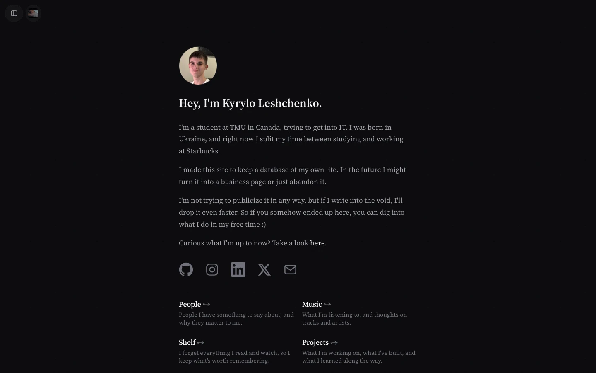
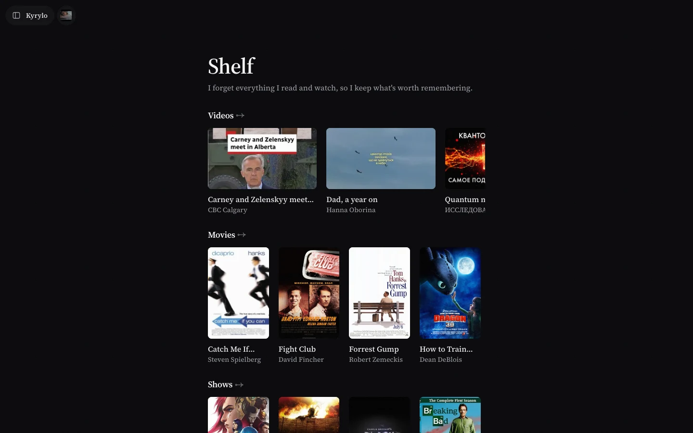

# Vaultsite

[](https://github.com/Kryloss/vaultsite/actions/workflows/check.yml)
[](./LICENSE)

My personal site, published straight from an [Obsidian](https://obsidian.md) vault. A folder becomes a page, a note becomes a post, and a `git push` becomes a deploy. There is no database and no CMS.

**Live: [kryloss.com](https://kryloss.com)**

| Home | Shelf |
|---|---|
|  |  |

## How it works

```
Obsidian (write a note) → Obsidian Git (commit + push) → GitHub → Vercel (static build) → live
```

The `vault/` folder is the content. Each top-level folder with a `main.md` is a section of the site, and every other note inside it is an entry with its own URL. At build time Next.js reads the vault, turns Obsidian Markdown into HTML and generates every page as a static file. Nothing reads the file system or a database at request time.

| In Obsidian | On the site |
|---|---|
| Create `Posts/` with a `main.md` | New page at `/posts`, added to the sidebar |
| Add `Posts/How was my day.md` | Listed on `/posts`, own page at `/posts/how-was-my-day` |
| Paste an image into a note | Copied to `public/` at build time and served |
| Add `How was my day.uk.md` | The Ukrainian version of the same page |
| Keep a note in a `_drafts/` folder | Stays on my machine: Git ignores it |

## Features

- **Fully static.** Every route is generated at build time (`generateStaticParams`, `dynamicParams = false`), including search, the RSS feed, the sitemap and the Open Graph images.
- **Obsidian syntax.** Wiki links, embeds, callouts, sidenotes, and Excalidraw drawings that follow the light or dark theme. Code blocks are highlighted at build time with Shiki.
- **Two languages.** The interface and the notes exist in English and Ukrainian, with a language toggle.
- **Section types.** `posts`, `projects`, `people`, `now`, a `shelf` of books, films, shows, games and videos, and a `music` page with a cover deck and Apple Music players. New types plug into one registry ([docs/ADDING-PAGE-TYPES.md](./docs/ADDING-PAGE-TYPES.md)).
- **Reading tools.** Progress bar, contents rail with scroll-spy, reading position memory, link previews, an image lightbox and read-aloud.
- **Chrome.** A drawer sidebar, a Cmd+K command palette, keyboard shortcuts, light and dark themes, and reduced-motion support.
- **SEO.** Canonical URLs, JSON-LD, per-page Open Graph cards and feeds ([docs/SEO.md](./docs/SEO.md)).

## Stack

Next.js 15 (App Router) · React 19 · TypeScript (strict) · Tailwind CSS v4 · unified / remark / rehype · Shiki · Vercel

## Run it locally

Requires Node.js 22.6 or newer.

```bash
npm install
npm run dev     # http://localhost:3000
npm run check   # typecheck + unit tests + image-note validation
npm run build   # static build of every page
```

The tests use Node's built-in runner, with no test framework: `lib/*.test.ts` and `scripts/*.test.mjs`. The same `npm run check` runs in GitHub Actions on every push.

## Repository layout

| Path | What it holds |
|---|---|
| `vault/` | All content: notes, images, translations. The only folder edited day to day. |
| `app/` | Routes, layout, feeds, Open Graph images, `globals.css` (design tokens) |
| `components/` | React components; `components/lists/` has one list per section type |
| `lib/` | The engine. `vault.ts` maps folders to pages, `markdown.ts` renders Obsidian Markdown, plus pure functions with tests beside them |
| `scripts/` | Build helpers (`sync-assets.mjs` mirrors vault images to `public/`) and the local authoring sidecar |
| `docs/` | Architecture, design system and the decision log |

## Documentation

- [SETUP.md](./SETUP.md): one-time setup of GitHub, Vercel and Obsidian
- [docs/ARCHITECTURE.md](./docs/ARCHITECTURE.md): how everything fits together
- [docs/DESIGN-SYSTEM.md](./docs/DESIGN-SYSTEM.md): tokens, breakpoints and the monochrome rule
- [docs/DECISIONS.md](./docs/DECISIONS.md): a numbered log of every non-obvious choice and the reason for it
- [docs/VERIFY.md](./docs/VERIFY.md): the checks to run before a change ships
- [AGENTS.md](./AGENTS.md): the rules AI coding agents follow in this repo

## How it was built

I designed the site and direct the work; most of the code was written with AI coding agents (Claude Code and Codex) under the rules in [AGENTS.md](./AGENTS.md). Every decision is recorded in [docs/DECISIONS.md](./docs/DECISIONS.md). The design is inspired by [brianlovin.com](https://brianlovin.com); the implementation is original.

## License

The code is under the [MIT License](./LICENSE). The content in `vault/` (writing, notes, photographs) is © Kyrylo Leshchenko, all rights reserved. Cover art and portraits belong to their owners.
